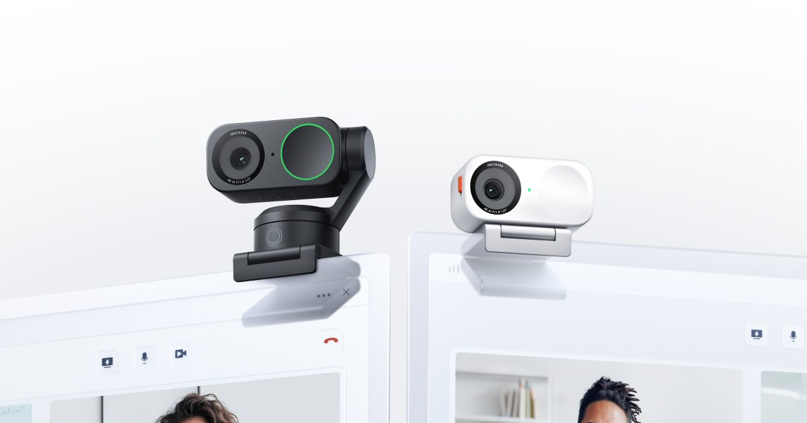
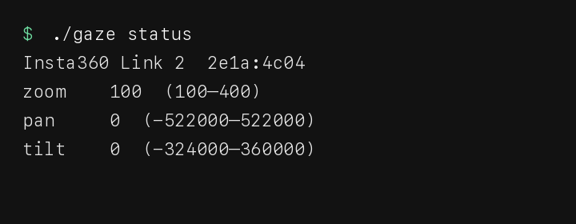
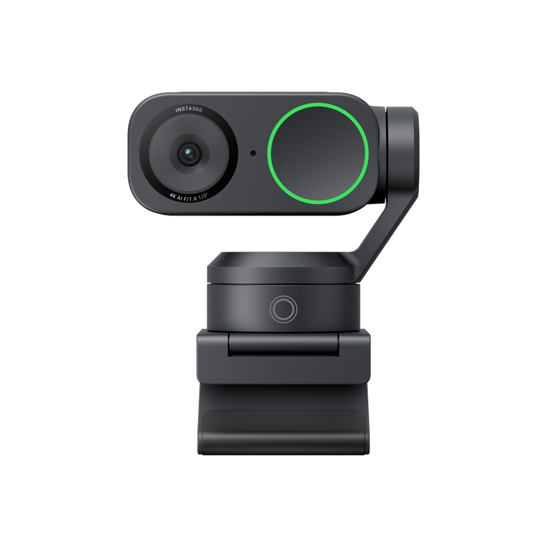
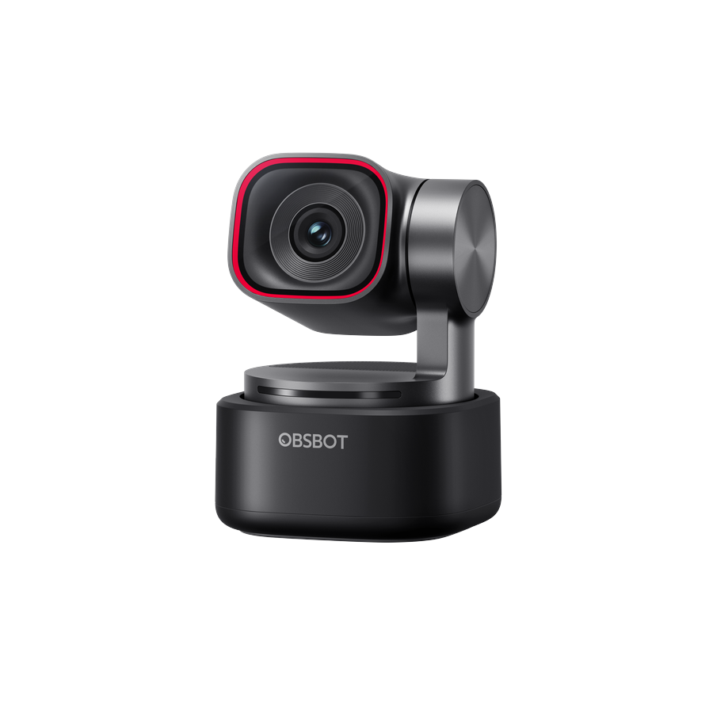
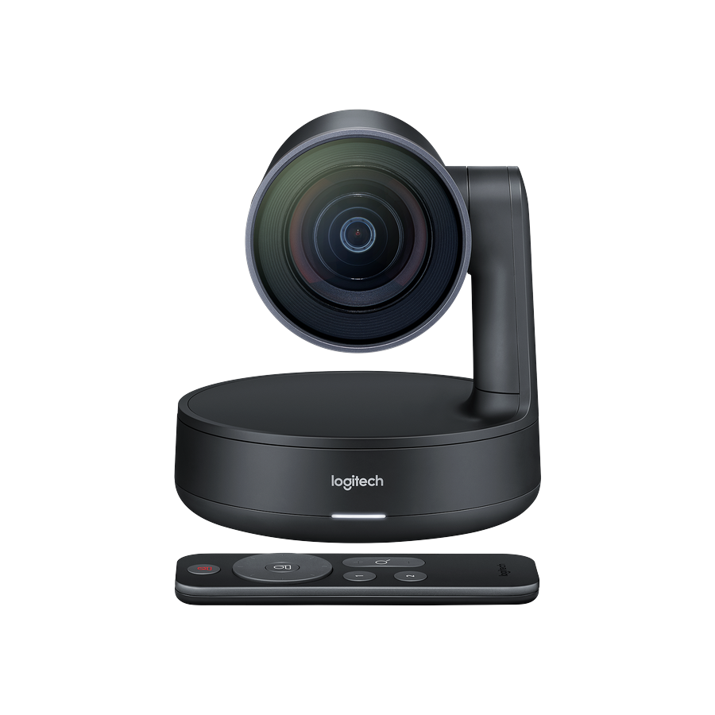
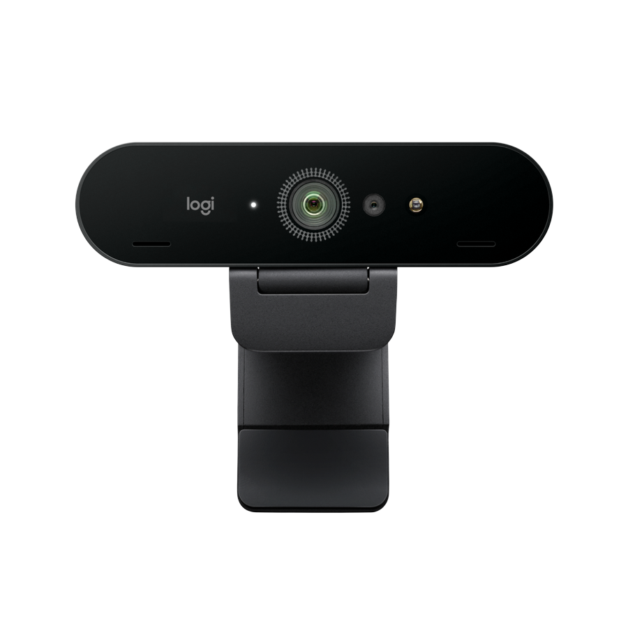
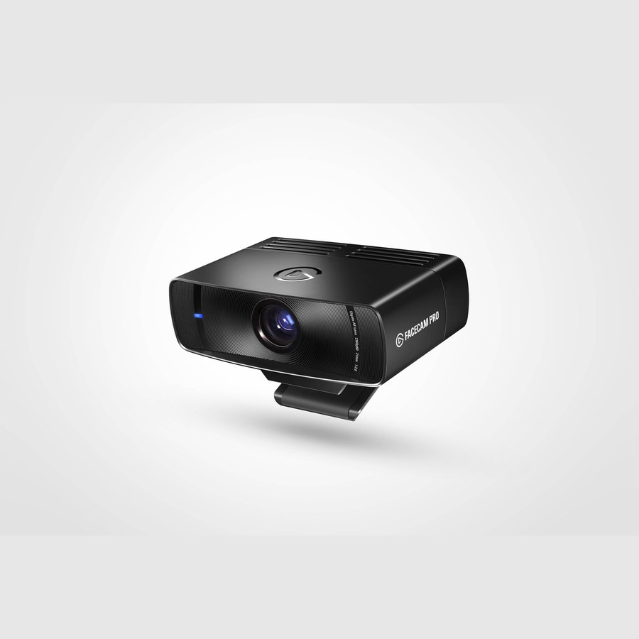
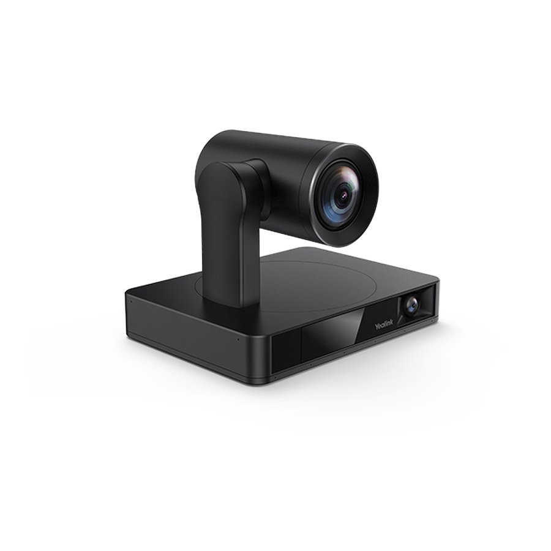

<h1 align="center">gaze</h1>

<p align="center">
  
</p>

<p align="center"><b>Give your agents eyes.</b></p>

<p align="center">Native PTZ. No vendor app.</p>

<p align="center">
  USB Video Class on the wire. JPEG from the same <code>vid:pid</code> that pans.
  Gimbal optional. Zoom optional.
</p>

<p align="center">
  
</p>

<p align="center"><code>g q=v</code> turns the sensor on and returns a JPEG. That is the eyes.</p>

## Cameras

Gaze talks USB Video Class 1.1. The picture and the gimbal are the same USB device (`UVC Camera VendorID_… ProductID_…` on AVFoundation, not the localized name). `gaze list` is the source of truth. Zoom / pan / tilt only if that Camera Terminal has the control. Vendor AI tracking is a separate XU.

<table align="center">
  <tr>
    <td align="center" width="220">
      <br>
      <b>Insta360</b><br>Link · Link 2 · Link 2 Pro · Link 2C
    </td>
    <td align="center" width="220">
      <br>
      <b>OBSBOT</b><br>Tiny · Tiny 2 · Tiny 3 · Tiny SE
    </td>
    <td align="center" width="220">
      <br>
      <b>Logitech</b><br>Rally · Rally Bar · Meetup · PTZ Pro
    </td>
  </tr>
  <tr>
    <td align="center" width="220">
      <br>
      <b>Logitech</b><br>Brio · MX Brio · C920 · StreamCam
    </td>
    <td align="center" width="220">
      <br>
      <b>Elgato</b><br>Facecam · Facecam Pro · Facecam 4K
    </td>
    <td align="center" width="220">
      <br>
      <b>Yealink</b><br>UVC30 · UVC34 · UVC84 · UVC86
    </td>
  </tr>
</table>

| Brand | Models | Status |
| --- | --- | --- |
| **Insta360** | Link 2 | **Proven** see + zoom + pan/tilt (`2e1a:4c04`) |
| **Apple** | Studio Display | **Proven** see + zoom + pan/tilt (`05ac:1114`) |
| **Insta360** | Link, Link 2 Pro, Link 2C | UVC, untested here |
| **OBSBOT** | Tiny, Tiny SE, Tiny 2, Tiny 3 | UVC PTZ, untested here |
| **Logitech** | Rally, Rally Bar, Meetup, PTZ Pro 2 | UVC PTZ if the Camera Terminal has pan/tilt |
| **Logitech** | Brio, MX Brio, C920, StreamCam | UVC zoom if present. No gimbal. |
| **Elgato** | Facecam, Facecam Pro, Facecam 4K | UVC. No gimbal. |
| **Yealink** | UVC30, UVC84, UVC86 | UVC PTZ, untested here |
| **AVer** | CAM520, CAM550, CAM570 | UVC PTZ, untested here |
| **PTZOptics**, **HuddleCamHD**, **Tenveo**, **NexiGo** | USB UVC SKUs | if the terminal has the control |

Quit the vendor controller first. Insta360 Webcam, OBSBOT Center, Logitech Tune, Elgato Camera Hub, Yealink USB Connect, AVer PTZApp.

## Install

macOS (Homebrew):

```bash
brew tap Obedience-Corp/tap
brew install gaze
gaze list
```

Linux (from source). Needs a C compiler, `just`, and `libjpeg` (MJPEG cameras work without encoding; YUYV falls back to libjpeg):

```bash
just build
./bin/gaze list
```

The operator must be in the `video` group (`/dev/video*`). Same CLI as macOS: `gaze see`, `gaze mcp`, optional PTZ when the UVC Camera Terminal exposes it (V4L2 `ZOOM`/`PAN`/`TILT` absolute).

From source on either OS: `just build`. Protocol tests (no camera): `just test-protocol`. Hardware matrix: `just test-hw`.

Release binary (Apple Silicon): [v0.2.0](https://github.com/Obedience-Corp/gaze/releases/tag/v0.2.0) `gaze-darwin-arm64`.

## Plugins

The binary is the MCP server (`gaze mcp`). Plugins do not wrap it in npm.

<table align="center">
  <tr>
    <td align="center"><b>Claude Code</b></td>
    <td>

```
/plugin marketplace add Obedience-Corp/gaze
/plugin install gaze@gaze
```

</td>
  </tr>
  <tr>
    <td align="center"><b>Grok</b></td>
    <td>

```
grok plugin marketplace add Obedience-Corp/gaze
grok plugin install gaze --trust
```

</td>
  </tr>
  <tr>
    <td align="center"><b>Codex</b></td>
    <td>

```
codex plugin marketplace add Obedience-Corp/gaze
```

</td>
  </tr>
  <tr>
    <td align="center"><b>Gemini CLI</b></td>
    <td>

```
gemini extensions install https://github.com/Obedience-Corp/gaze
```

Optional pin: `gemini extensions config gaze GAZE_DEV`

</td>
  </tr>
  <tr>
    <td align="center"><b>Cursor</b></td>
    <td>

Agent Plugin (`plugin.json` + `mcp.json`). Local:

```
ln -s "$(pwd)" ~/.cursor/plugins/local/gaze
```

Or paste `clients/cursor.json` into `~/.cursor/mcp.json`.

[Add to Cursor](cursor://anysphere.cursor-deeplink/mcp/install?name=gaze&config=eyJjb21tYW5kIjoiZ2F6ZSIsImFyZ3MiOlsibWNwIl19)

</td>
  </tr>
</table>

<p align="center">
  <a href="vscode:mcp/install?%7B%22name%22%3A%22gaze%22%2C%22command%22%3A%22gaze%22%2C%22args%22%3A%5B%22mcp%22%5D%7D">Add to VS Code</a>
  · Claude Desktop → <code>clients/claude-desktop.json</code>
  · Windsurf → <code>clients/windsurf.json</code>
  · Cline → <code>clients/cline.json</code>
</p>

Pin a camera with `GAZE_DEV=vid:pid` or `gaze -d vid:pid mcp`. Two cameras on the bus: do not use the default.

## MCP

The camera is the tool. `q=v` is the frame (JPEG). Moves stay one line so they do not burn tokens. After a move you already have state — do not call `s` again. Call `v` when you need to look.

```json
{
  "mcpServers": {
    "gaze": {
      "command": "gaze",
      "args": ["-d", "2e1a:4c04", "mcp"]
    }
  }
}
```

| q | |
|--|--|
| `v` | JPEG from the sensor (turns the camera on) |
| `s` | status (text only) |
| `c` | center |
| `z 200` / `z +20` | zoom |
| `p N` / `t N` | pan / tilt |

Reply: `2e1a:4c04 z=200 p=0 t=0`

## Commands

| | |
|--|--|
| `gaze status` | name, zoom, pan, tilt, mode |
| `gaze see [file]` | JPEG from the sensor (default `see.jpg`) |
| `gaze center` | pan 0, tilt 0, default zoom |
| `gaze zoom 200` | absolute, or `+20` / `-20` |
| `gaze pan` / `gaze tilt` | same, native UVC units |
| `gaze track on\|off` | writes Insta360 mode XU (Link 2 GET_CUR is stale) |
| `gaze deskview` / `overhead` / `whiteboard` | same |
| `gaze normal` | mode XU off |

FaceTime can keep the stream. Gaze uses IOKit `DeviceRequest` on the device node, no exclusive interface grab.

## License

Apache 2.0.

PTZ uses USB Video Class 1.1 Camera Terminal controls. Insta360 mode bytes on XU unit 9 selector 2 are the community-documented map (normal / track / whiteboard / overhead / deskview), confirmed on a Link 2.

Product photos: [Insta360](https://store.insta360.com/product/link-2) Link 2 / Link 2C, [OBSBOT](https://www.obsbot.com/store/products/tiny-3-series) Tiny 3, [Logitech](https://www.logitech.com/en-us/products/video-conferencing/conference-cameras/rally-ultra-hd-ptz-camera.html) Rally and [Brio](https://www.logitech.com/en-us/products/webcams/brio-4k-hdr-webcam.960-001105.html), [Elgato](https://www.elgato.com/us/en/p/facecam-pro) Facecam Pro, [Yealink](https://www.yealink.com/en/product-detail/compatible-camera-uvc86) UVC86.

---

Built with [Festival](https://fest.build)
